# Data Wrangling Final for GitHub
Drew Berkland

## File Uploads

``` python
import pandas as pd
data= pd.read_csv("C:/Users/drewb/Downloads/MLB_Player_Data.csv")
```

## Question 1: How do performance statistics compare between HOFers and Non HOFers?

``` python
data['HOF Status'] = data['HOF Status'].astype(str).str.lower()

data['HOF Status'] = data['HOF Status'].apply(lambda x: 1 if x in ['true'] else 0)

numeric_cols = data.select_dtypes(include='number').columns.tolist()

hof_compare = data.groupby('HOF Status')[numeric_cols].mean()

hof_compare
```

<div>
<style scoped>
    .dataframe tbody tr th:only-of-type {
        vertical-align: middle;
    }
&#10;    .dataframe tbody tr th {
        vertical-align: top;
    }
&#10;    .dataframe thead th {
        text-align: right;
    }
</style>

|  | HOF Status | WAR | First Season | Last Season | Debut Age | Final Season Age | G | PA | AB | R | ... | IBB | WAA | oWAR | dWAR | Rbat | Rdp | Rbaser | Rbaser + Rdp | Rfield | Seasons Played |
|----|----|----|----|----|----|----|----|----|----|----|----|----|----|----|----|----|----|----|----|----|----|
| HOF Status |  |  |  |  |  |  |  |  |  |  |  |  |  |  |  |  |  |  |  |  |  |
| 0 | 0.0 | 17.308546 | 1980.061627 | 1992.259655 | 22.505341 | 34.703369 | 1335.382909 | 4905.195563 | 4368.626952 | 581.608053 | ... | 39.417420 | 1.065818 | 17.282416 | 0.002629 | 12.682827 | -0.298274 | 0.806081 | 0.529992 | 1.345111 | 0.014158 |
| 1 | 1.0 | 72.163768 | 1971.869565 | 1990.275362 | 20.710145 | 39.115942 | 2461.724638 | 10264.289855 | 8995.536232 | 1411.043478 | ... | 138.956522 | 38.086957 | 68.643478 | 1.388406 | 341.942029 | -3.246377 | 18.173913 | 14.942029 | 34.347826 | 18.405797 |

<p>2 rows × 41 columns</p>
</div>

First, I cleaned the binary HOF Status column to make sure all of the
T/F values were lowercase. Then, I used the lambda function to assign
numeric values (1 or 0) to the HOF Status column. A player with HOF
Status = 1 is a HOFer. From there, I was able to run the mean of each
numeric column to compare the performance statistics between HOfer and
Non HOFer

Now, I will vizualize these stats using a for loop that iterates through
each numeric stat, creating a box plot for each one. This will further
respond to the question I posed.

``` python
import seaborn as sns
import matplotlib.pyplot as plt

numeric_stats = data.select_dtypes(include="number").columns

for stat in numeric_stats:
    plt.figure(figsize=(6, 4))
    sns.boxplot(data=data, x="HOF Status", y=stat)
    plt.title(f"HOF vs Non-HOF: {stat}")
    plt.xlabel("HOF Status")
    plt.ylabel(stat)
    plt.tight_layout()
    plt.show()
```

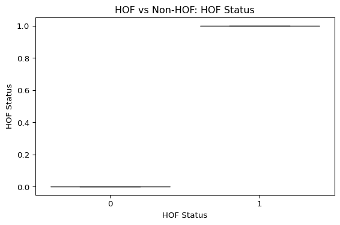

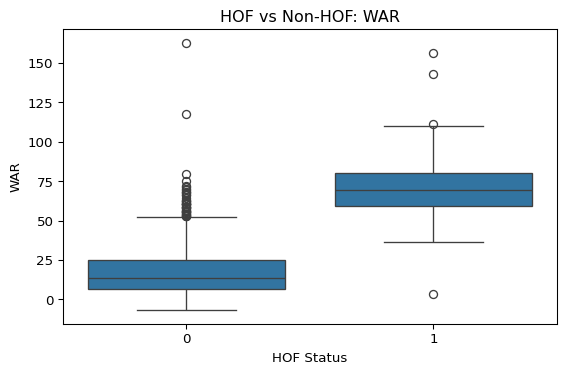

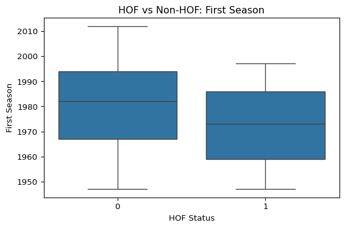

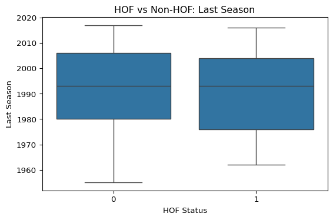

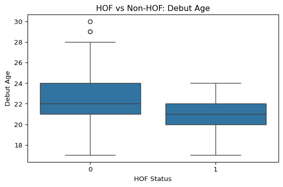

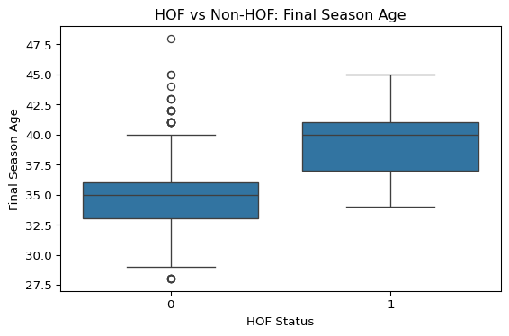

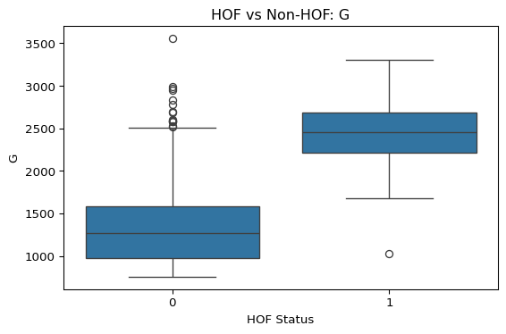

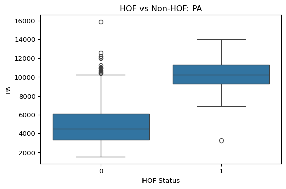

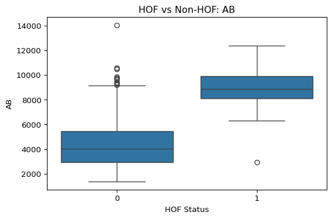

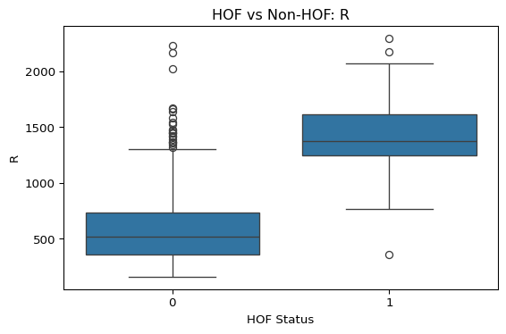

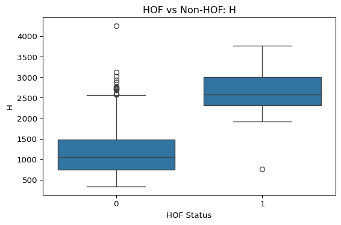

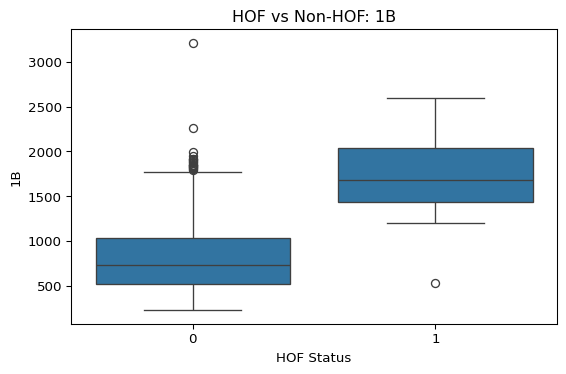

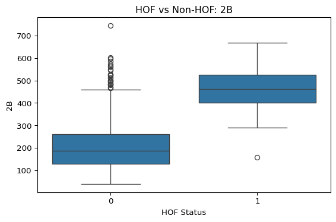

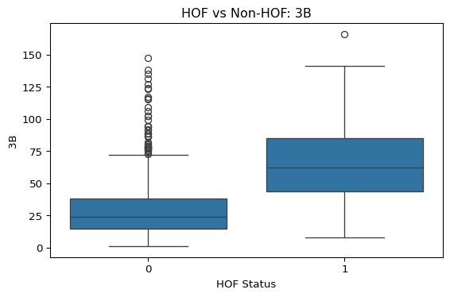

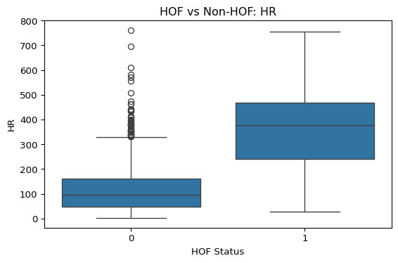

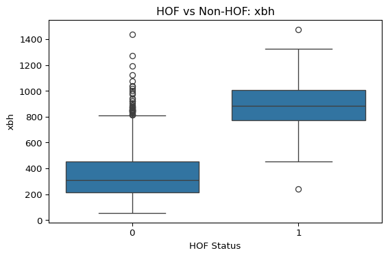


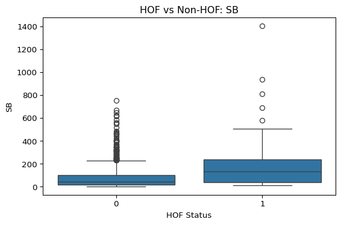

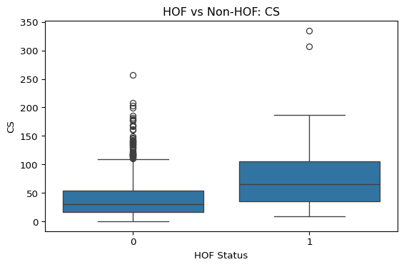

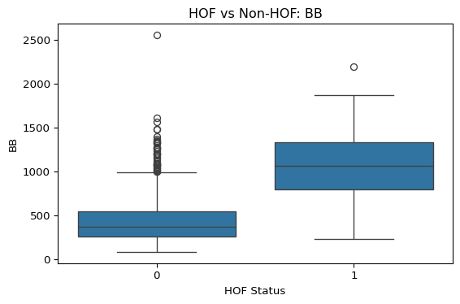

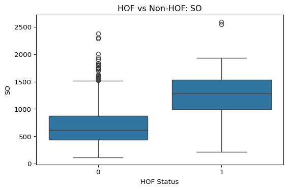

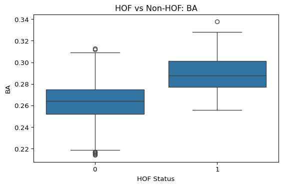

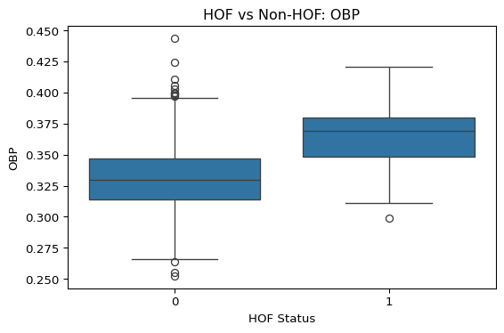

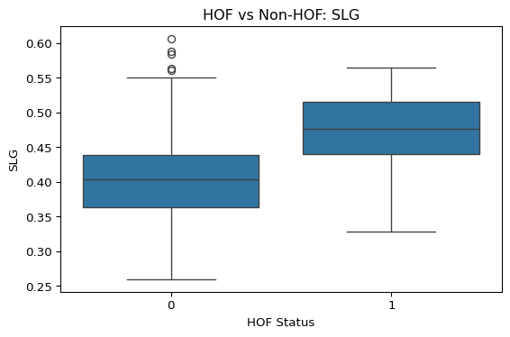

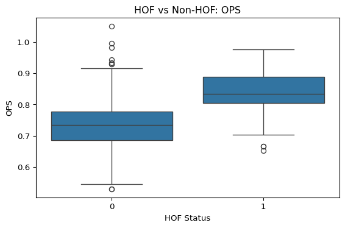

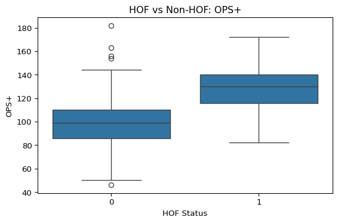

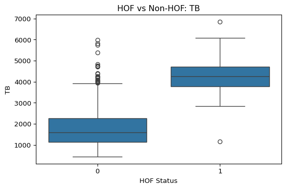

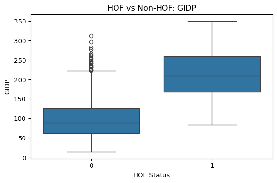

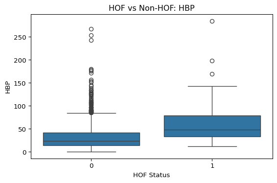

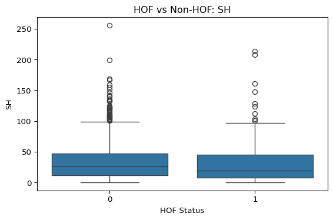

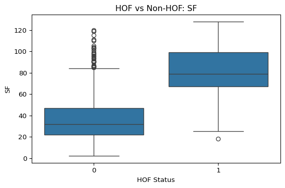

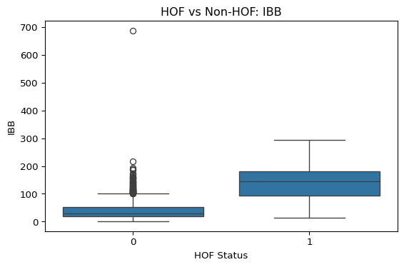

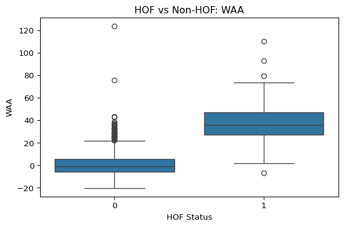

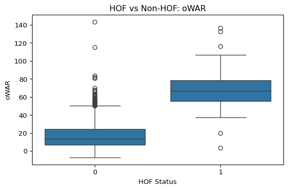

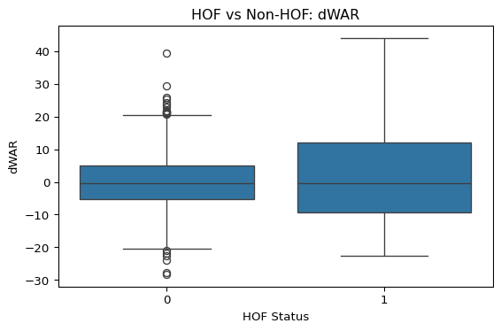

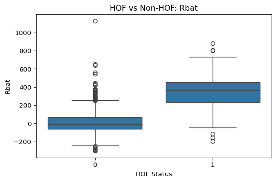

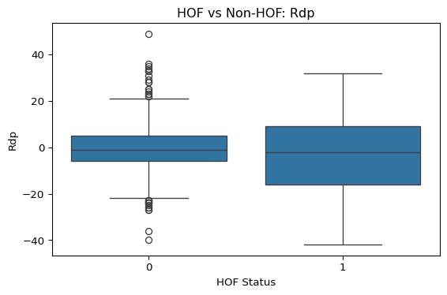

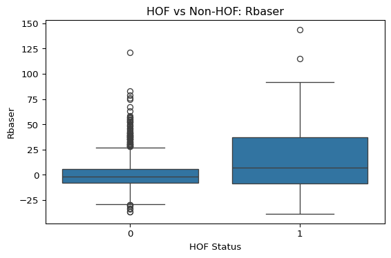

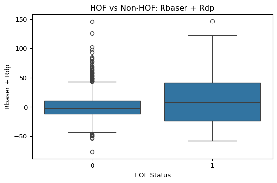

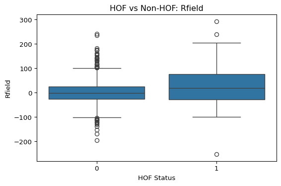

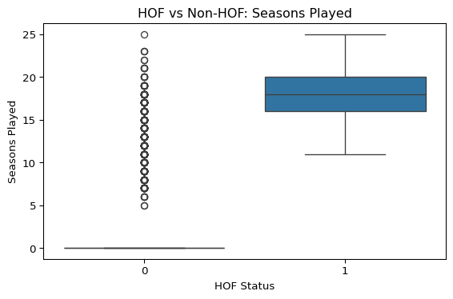

The box plots clearly show that key statistics such as WAR, BA, WAA,
OPS, SLG are significantly higher amongst HOFers. This is to be
expected, but it shows that each statistical categroy is much higher.
One thing that jumps out to me is the amount of games played between
HOFers and Non HOFers. HOFers have more longevity in the game which
allows them more time to post their high statistics. This is shown
through the aggregated mean code block and the box plot for loop.

## Question 2: How can we look at WAR to predict HOF Status?

WAR is a big statistic used in the MLB today. I wanted to run a model to
show how it affects HOF status. I first did this through bootstrap
sampling.

``` python
import numpy as np
import statsmodels.api as sm
import seaborn as sns
import matplotlib.pyplot as plt

bootstrap_samples = 100
t_values = []

for i in range(bootstrap_samples):
    sample = data.sample(frac=1, replace=True)
    model = sm.formula.ols(f'Q("WAR") ~ Q("HOF Status")', data=sample).fit()
    t_val = model.tvalues['Q("HOF Status")']
    t_values.append(t_val)

sns.histplot(t_values)
plt.title("Bootstrap t-values for HOF Status effect on WAR")
plt.show()
```

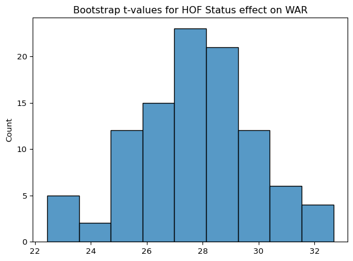

The bootstrap tvalues model shows that a player’s WAR is signifcant in
predicting whether they will make the HOF or not. This means looking at
WAR is highly reliable in determinig HOF Status.

Next, I wanted to see the magnitude, direction, and p-value significance
of WAR on HOF Status. I ran a simple regression here.

``` python
import statsmodels.formula.api as smf

regression = smf.ols("WAR ~ Q('HOF Status')", data=data).fit()
regression.summary()
```

|                   |                  |                     |           |
|-------------------|------------------|---------------------|-----------|
| Dep. Variable:    | WAR              | R-squared:          | 0.377     |
| Model:            | OLS              | Adj. R-squared:     | 0.376     |
| Method:           | Least Squares    | F-statistic:        | 775.7     |
| Date:             | Wed, 03 Dec 2025 | Prob (F-statistic): | 6.30e-134 |
| Time:             | 09:01:43         | Log-Likelihood:     | -5382.5   |
| No. Observations: | 1286             | AIC:                | 1.077e+04 |
| Df Residuals:     | 1284             | BIC:                | 1.078e+04 |
| Df Model:         | 1                |                     |           |
| Covariance Type:  | nonrobust        |                     |           |

OLS Regression Results

|                 |         |         |        |          |         |         |
|-----------------|---------|---------|--------|----------|---------|---------|
|                 | coef    | std err | t      | P\>\|t\| | \[0.025 | 0.975\] |
| Intercept       | 17.3085 | 0.456   | 37.938 | 0.000    | 16.414  | 18.204  |
| Q('HOF Status') | 54.8552 | 1.970   | 27.851 | 0.000    | 50.991  | 58.719  |

|                |         |                   |          |
|----------------|---------|-------------------|----------|
| Omnibus:       | 540.437 | Durbin-Watson:    | 1.734    |
| Prob(Omnibus): | 0.000   | Jarque-Bera (JB): | 4071.999 |
| Skew:          | 1.769   | Prob(JB):         | 0.00     |
| Kurtosis:      | 10.967  | Cond. No.         | 4.45     |

<br/><br/>Notes:<br/>[1] Standard Errors assume that the covariance matrix of the errors is correctly specified.

Hall of Famers average roughly 55 more WAR than non-HOF players, meaning
WAR is a separator between the groups. The model explains about 38% of
the variation in career WAR shown by R- Squared. The p-value is below
.05 indicating a significant relationship.

One thing to note here is that while this variable is significant and
his positive direction, the lower r-squared means that there are other
strong predictors of HOF status outside of WAR.

## Question 3: How does batting average differ by decade and HOF Status?

In baseball, there are arguments that hitters are focusing less on
average and more on power. Therefore, power numbers (SLG) are up and
average numbers are down. I wanted to test this theory and see the trend
between the two classes I made earlier of HOFer and non HOFer.

``` python
data['decade'] = (data['Last Season'] // 10) * 10

ba_pivot = data.pivot_table(index='decade',columns='HOF Status', values='BA', aggfunc='mean')

print(ba_pivot)
```

    HOF Status         0         1
    decade                        
    1950.0      0.263263       NaN
    1960.0      0.262900  0.286667
    1970.0      0.253613  0.286938
    1980.0      0.263370  0.281273
    1990.0      0.262046  0.288769
    2000.0      0.268609  0.297643
    2010.0      0.265191  0.296667

Here, I had to make a ‘decade’ column using a floor division operator to
get what decade the players’ last seasone was in. From there, I could
pivot each decade, organize by HOF Status, and have BA appear in the
values.

The numbers here kind of debunked the theory that batting average is
trending down over time. This was surprising to me. This could be due to
sample size of the dataset, but interesting nontheless.
